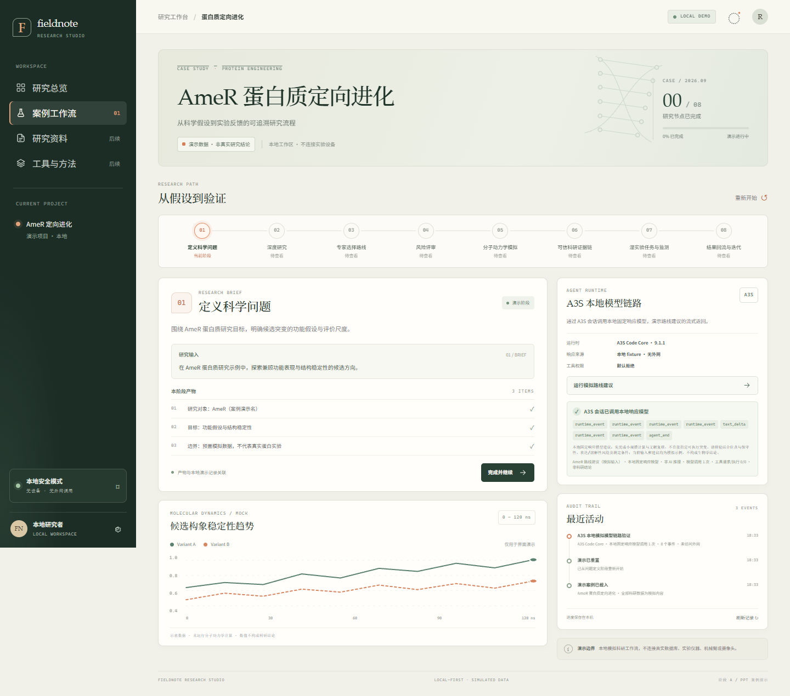
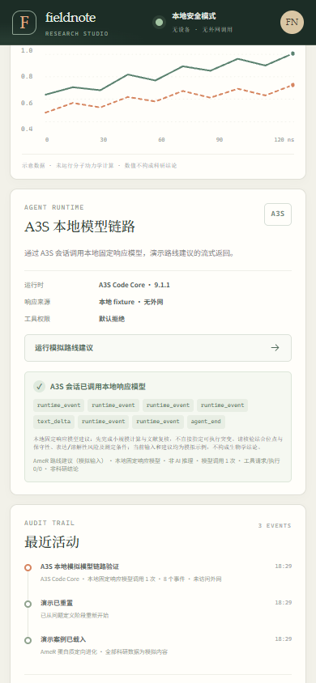

# 阶段 A 验收报告：AmeR 蛋白质定向进化

**日期：** 2026-09-30
**项目：** Fieldnote Research Studio
**验收范围：** PPT 案例演示、本地 Rust API、A3S 会话接入、前端交互与本地安全边界

## 验收结论

阶段 A 的本地演示主链路已实现并通过本轮代码与浏览器检查。案例包含八个可导航研究阶段；进度和事件可本地保存、推进、刷新恢复与重置。A3S Code Core 9.1.1 已通过宿主 `LlmClient` 接口调用本地固定响应 fixture，并将运行时事件和响应显示在页面中。

该 fixture 不是 AI 推理，案例材料也不是经核验的科研结论。项目未连接外部模型服务、科研数据库、计算集群、实验设备或机器人硬件。本文档用于向用户汇报阶段 A；阶段 B“论文工具”尚未启动。

## 交付内容

- React + TypeScript 工作台，采用 Vite、Tailwind CSS、shadcn/ui 风格组件和 Zustand。
- Rust + Axum 本地 API，提供案例查询、事件、阶段推进/重置与 A3S 会话端点。
- AmeR 案例八阶段：问题定义、深度研究、路线选择、风险评审、分子动力学演示、证据链、湿实验任务/监测、结果回流。
- 本地 JSON 进度持久化；界面将研究材料、曲线、任务和 fixture 响应标为模拟/演示。
- 原创 Fieldnote 品牌与本地运行说明；没有使用书生 Logo 或 PPT 视频素材。

## A3S 接入证据

后端锁定 `a3s-code-core = 9.1.1`，在 `SessionOptions` 中注入本地 `LlmClient`，通过 `AgentSession::stream` 提交 AmeR 路线建议请求。响应经 A3S 事件流返回，页面可观察到 `text_delta`、`agent_end` 等事件。

测试中的模型客户端只返回源码中定义的固定文本，不发起 HTTP 请求。界面明确显示“本地固定响应模型 · 非 AI 推理”，并展示模型调用次数和工具请求/执行次数。工具权限策略默认拒绝；测试覆盖未列出的 shell、文件写入、网络搜索和硬件控制工具。实际浏览器运行中工具请求/执行为 `0 / 0`。

固定响应仅用于证明 A3S 会话及宿主模型接口可以在无凭证条件下工作，不代表模型生成或生物学建议。后续接入真实模型需要另行选择供应商、配置凭证并明确授权。

## 验证结果

| 检查项 | 结果 |
|---|---|
| Rust 单元测试 | 3 项通过，0 项失败 |
| Rust 格式检查 | `cargo fmt -- --check` 通过 |
| TypeScript 类型检查 | `npm run typecheck` 通过 |
| 前端生产构建 | `npm run build` 通过；Vite 构建 47 个模块 |
| 本地 API | `/api/health` 返回 `status: ok`，数据标记为 `simulated` |
| A3S 浏览器交互 | 固定建议成功返回；事件流含 `text_delta` 与 `agent_end` |
| 浏览器网络与控制台 | 页面请求仅使用本机 `127.0.0.1`；无页面运行错误，只有 React DevTools 提示 |
| 窄屏布局 | 390 × 844 检查通过；文档无横向溢出，研究阶段导航在自身区域横向滚动 |
| 服务监听 | 前端 `127.0.0.1:5173`；后端 `127.0.0.1:8081` |

## 界面截图

桌面工作台与 A3S fixture 运行结果：

<!-- PDF page break -->

390px 窄屏视图：

## 未实现与限制

- 没有真实模型推理、文献检索、实验数据、分子动力学计算或实验室设备控制。
- 进度保存在单机 JSON 文件中，尚无多用户、数据库、鉴权或云端同步。
- 路线建议内容为固定 fixture，不可用于真实研究决策。
- “论文工具”及其他全站模块尚未实现；公网部署与 Kubernetes 部署不在本阶段范围内。
- GitHub 仓库未提交、未推送；真实硬件和实验室服务器均未访问。

## 后续门槛

请先验收本阶段报告和本地演示。只有阶段 A 汇报完成后，才开始阶段 B 的论文检索、PDF 精读和引文核验模拟流程。
