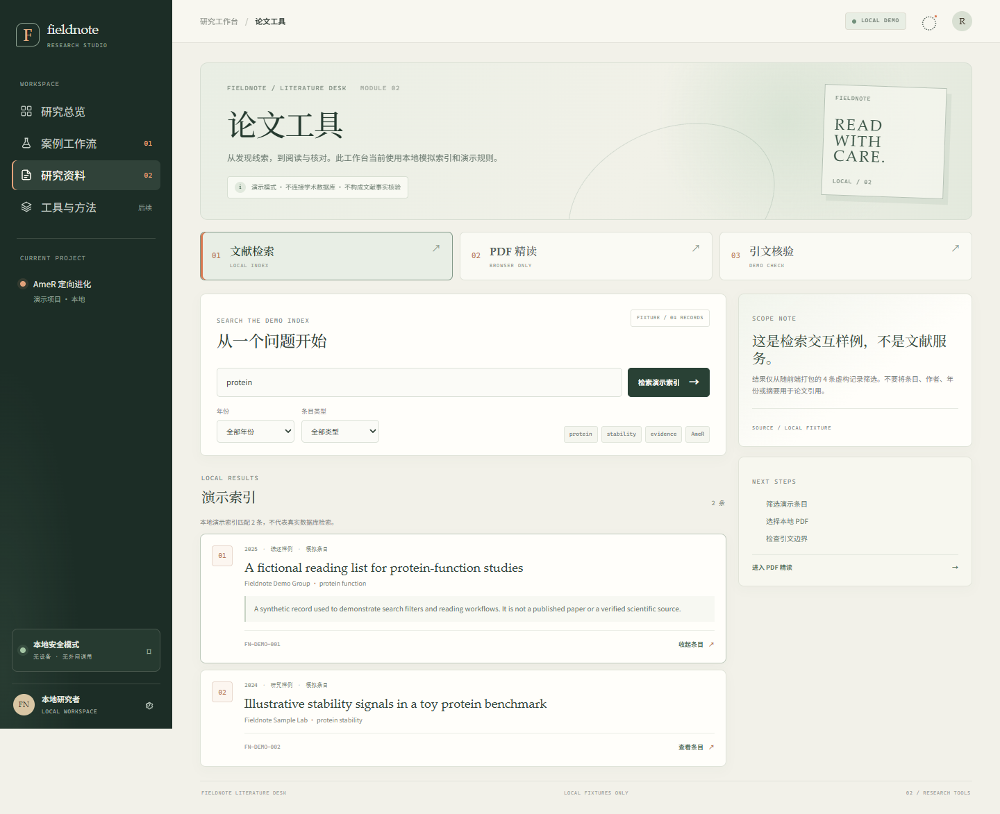
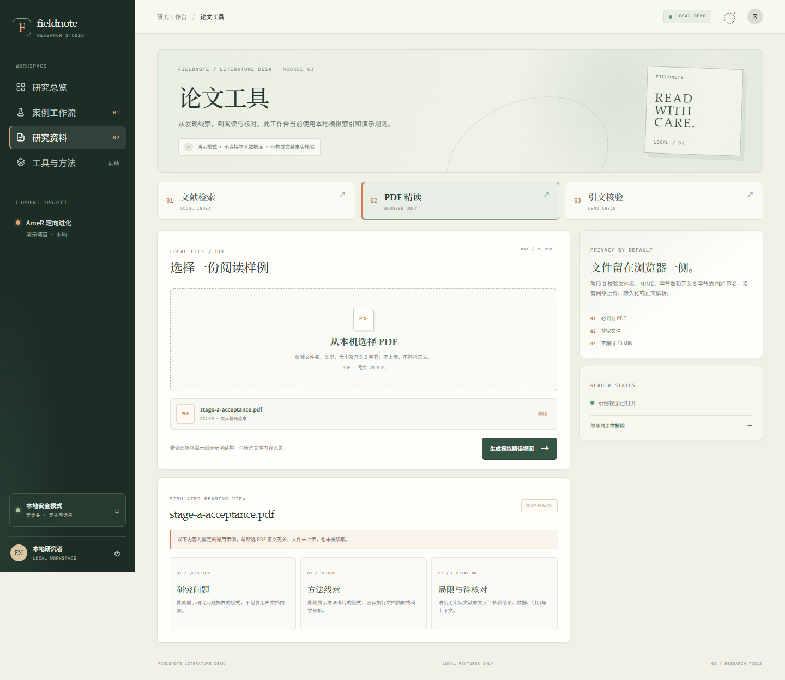
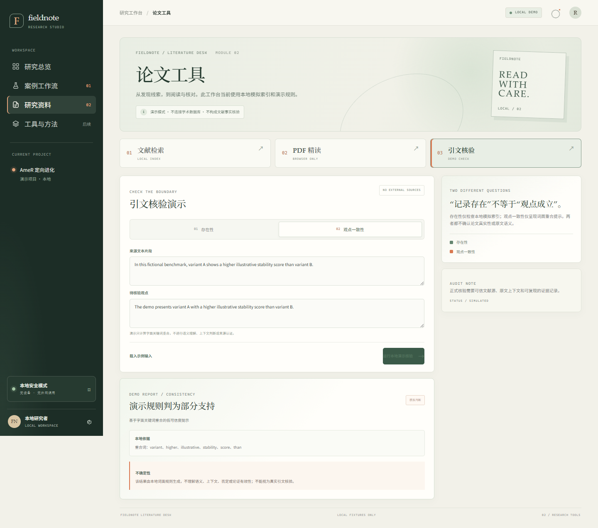
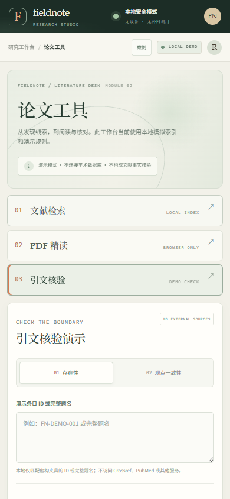

# 阶段 B 验收报告：论文工具本地模拟版

**日期：** 2026-09-30  
**项目：** Fieldnote Research Studio  
**验收范围：** 文献检索、PDF 精读交互、引文存在性与观点一致性演示、桌面/窄屏及本地安全边界

## 验收结论

阶段 B 的三个论文工具页签已实现并完成本地浏览器验收：文献检索、PDF 精读和引文核验可导航，各自具备输入、反馈和结果状态。桌面与 390px 窄屏下的关键路径、键盘页签切换和 PDF 错误限制均通过。

本阶段是前端模拟流程，不是正式文献产品：索引内仅有 4 条虚构条目；PDF 正文不上传、不解析，精读面板展示与用户文件无关的固定样例；引文判断由本地 ID/题名匹配和字面关键词比例规则生成，不访问数据库或调用 AI。

## 交付内容

- “研究资料”工作区包含三个由 Zustand 管理当前页签的视图：文献检索、PDF 精读、引文核验。
- 检索支持关键词、年份和条目类型过滤，显示虚构结果、展开摘要详情、加载、空结果与输入错误状态。
- PDF 本地输入限制为 `.pdf`、非空、MIME 允许值、文件头 `%PDF-` 及不超过 20 MiB。仅检查元信息和开头 5 字节；不上传、不解析正文、不持久化文件。后续阅读视图固定显示通用示例，并重复标明与文件内容无关。
- 引文存在性只匹配本地演示 ID 或完整题名；观点一致性只计算来源文本与观点间的字面词项重合。报告包含判断、依据和不确定性说明。
- 桌面侧栏和手机顶栏提供案例工作流/论文工具切换；手机三页签使用单列排版。

## 验证结果

| 检查项 | 结果 |
|---|---|
| TypeScript 类型检查与生产构建 | `npm run build` 通过；包含 `tsc --noEmit` 与 Vite production build |
| Rust 回归 | 3 项通过，0 项失败 |
| Rust 格式检查 | `cargo fmt -- --check` 通过 |
| 检索交互 | 空输入提示、关键词命中、年份/类型筛选、无命中状态和详情展开通过 |
| PDF 限制 | 实际本地 PDF 签名通过；错误 MIME、错误文件头、空文件及 20 MiB + 1 字节均被拒绝 |
| 引文交互 | 空输入校验、存在性命中、本地字面规则观点报告通过 |
| 键盘与窄屏 | Tab/Enter 可切换页签；文献、PDF、引文三视图在 390px 下检查无水平溢出，宽度为 390/390 |
| 浏览器运行 | 关键路径无 JavaScript page error；观测到的请求仅为 `127.0.0.1` 本地页面/API，无外部请求 |
| 设备与发布边界 | 未连接真实文献服务、模型 API、实验设备或实验室服务器；未进行公网/Kubernetes 部署 |

Rust 离线缓存缺少 `mio`/`ahash` 时，回归测试使用单次命令级 `rsproxy.cn` 源替换后完成；没有修改全局 Cargo 配置。此次只改前端与说明文档，Rust 源码未变。

<!-- PAGE BREAK -->

## 页面截图

桌面文献检索与展开条目：

<!-- PAGE BREAK -->

桌面 PDF 文件头校验与模拟精读视图：

<!-- PAGE BREAK -->

桌面观点一致性报告：

<!-- PAGE BREAK -->

390px 手机视口下的引文工具：

## 未实现与限制

- 没有真实学术数据库检索、DOI 解析、论文下载或作者/期刊真实性验证。
- PDF 只检查扩展名、MIME、文件大小和 5 字节签名；不保证整个文件是结构完整、可阅读的 PDF，也没有文本/图表/参考文献抽取。
- 精读面板与所选文件无关，不能用于概括或评价该文件。
- 观点一致性只按词面比例提示，不处理否定、语义、上下文、论证、引用位置或来源可信度；存在性命中也仅代表夹具中有同 ID/题名。
- 论文工作区当前状态只在内存中，刷新后不保留；无用户身份、项目权限、数据库、文件持久化、协作、真实模型调用和后台任务队列。
- 项目当前仍是本地单机演示；没有部署到公网或 Kubernetes，也未推送阶段 B 改动。

## 后续建议

阶段 B 汇报并确认后，再按项目规格目录中的 `roadmap.md` 推进阶段 C：先设计课题/文档/运行/证据数据模型、数据库迁移和文件边界，再为多人访问补充认证、资源授权与备份恢复。真实文献源、A3S 模型提供方及任何研究材料外发都应单独确定授权和费用；封闭内测部署与公网发布继续分阶段审批。
